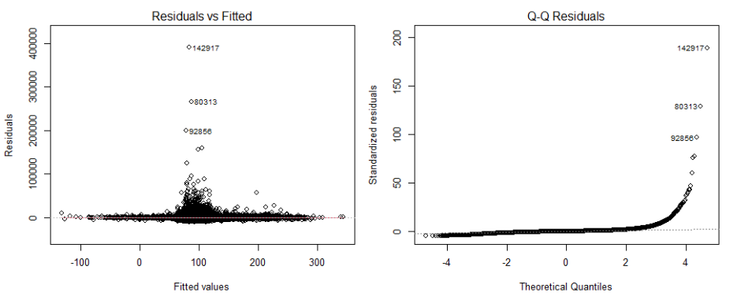
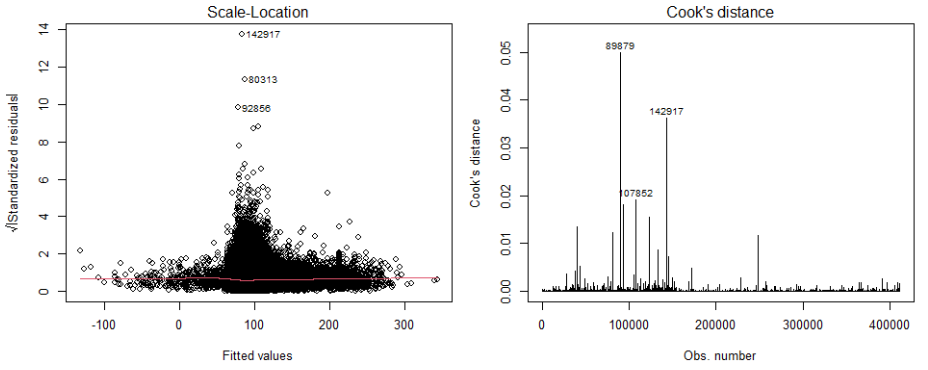

```{r setup, include=FALSE}
knitr::opts_chunk$set(
  echo = FALSE,
  fig.width = 12,
  fig.height = 5,
  fig.align = "center",
  out.width = "100%",
  warning = FALSE,
  message = FALSE,
  cache = FALSE
)

setwd("C:/Users/User/Desktop/ACCT3112 Final Project")

# Set seed for reproducibility
set.seed(42)

# Suppress scientific notation
options(scipen = 999)
```

```{r libraries, include=FALSE}
library(tidyverse)
library(data.table)
library(sandwich)
library(lmtest)
library(stargazer)
library(kableExtra)
library(lubridate)
library(stringr)
library(knitr)
library(dplyr)
library(haven)
library(ggplot2)  
library(DBI)
library(RPostgres)
library(dbplyr)
library(gridExtra)
```

# Abstract

This study examines the relationship between media disclosure, measured through RavenPack Analytics for Equities, and medium‑term stock returns in the U.S. equity market. Using a comprehensive dataset combining firm-specific news analytics (RavenPack), firm fundamentals (Compustat), and stock prices (CRSP) from 2010 to 2024, we analyze how news sentiment and information salience relate to subsequent stock price movements. To overcome identifier discrepancies, we employ a name-matching algorithm to link news data with financial records. We specifically test whether **information salience**, proxied by RavenPack’s Relevance Score, conditions the strength and direction of the sentiment–return relationship. Our analysis reveals a statistically significant **negative association** between positive news sentiment and **3‑month cumulative abnormal returns (CAR)**, consistent with price overreaction and subsequent mean reversion, with stronger reversals for high‑relevance events where the firm plays a key role in the news story. We also document substantial cross‑sectional heterogeneity, with larger market‑cap firms receiving disproportionately higher media attention.

**Keywords:** Media disclosure, sentiment analysis, CAR, RavenPack Analytics, information salience

---

# Introduction

## Research Background

In modern financial markets, information flows at unprecedented speeds through multiple channels. While academic research has established that news affects asset prices, much of this work relies on coarse sentiment proxies or focuses on very short event windows. Recent advances in natural language processing (NLP) now enable automated, granular extraction of structured sentiment and relevance measures from unstructured text (Tetlock, 2007).

RavenPack Analytics for Equities provides real‑time, event‑level sentiment scores and relevance metrics derived from a broad universe of professional news sources. A key feature is the **Relevance Score**, which distinguishes entities that play a central role in a story from those that are only incidentally mentioned. This allows for a more precise test of how information salience affects how quickly and accurately markets incorporate news.

This project merges RavenPack news analytics with Compustat and CRSP data to examine whether media sentiment is associated with subsequent stock performance. Rather than focusing exclusively on immediate reactions, we employ **market‑adjusted cumulative abnormal returns (CAR)** over a 3‑month horizon to capture both the short‑run response and any subsequent drift or reversal in prices.

## Research Questions

This project addresses three central questions:

1. **Media Sentiment and Returns**: Does firm-specific media sentiment predict medium‑term abnormal stock returns after controlling for market risk? We test whether the sign of the relationship is consistent with **underreaction** (positive sentiment followed by positive CAR) or **overreaction and mean reversion** (positive sentiment followed by negative CAR) (De Bondt & Thaler, 1985).

2. **Information Salience and Signal Amplification**: Does **news relevance** condition the relationship between sentiment and subsequent returns? We examine whether high‑relevance events—where the firm is central to the narrative—are associated with **stronger** sentiment–return effects, for example by amplifying subsequent reversals if prices overreact to salient news.

3. **Cross-Sectional Patterns in Coverage**: How is media coverage distributed across firms? We investigate whether larger, more visible companies receive disproportionately higher media attention, potentially creating an information asymmetry between large and small-cap stocks.

---

# Objectives

The **primary research goal** of this study is to empirically evaluate the informational efficiency of the U.S. equity market in response to high-frequency media signals. By integrating unstructured news analytics with structured financial data, we aim to adjudicate between two competing behavioral hypotheses—**market underreaction** (price drift) versus **market overreaction** (price reversal)—over a medium-term horizon.

Specifically, this study pursues the following four objectives:

**1. To Quantify the Term Structure of Sentiment-Driven Returns**

We aim to determine whether the aggregate sentiment of firm-specific news possesses predictive power for future stock performance beyond the immediate event window. While prior literature often focuses on short-term intraday or daily reactions, our objective is to isolate the **3-month cumulative abnormal return (CAR)** to detect persistent inefficiencies. This allows us to test whether media sentiment serves as a fundamental signal that is slowly incorporated into prices (supporting H1) or a behavioral trigger that induces temporary mispricing and subsequent mean reversion (supporting the alternative).

**2. To Assess the Conditioning Role of Information Salience**

A critical methodological objective is to move beyond "average" sentiment by incorporating **Signal Salience**. We aim to validate the utility of RavenPack’s **Relevance Score** as a filter for information quality.

*   **Differentiation:** We seek to distinguish between *substantive news* (where the firm is the protagonist) and *incidental coverage* (where the firm is a passive participant).
*   **Interaction Testing:** By interacting Sentiment with Relevance, we aim to test the "Amplification Hypothesis"—determining whether high-salience events trigger stronger behavioral responses from investors compared to low-relevance noise.

**3. To Map the Asymmetry of the Media Information Environment**

We aim to provide descriptive evidence on the structural biases present in financial media coverage. By analyzing the relationship between **Firm Size (Total Assets)** and **News Frequency**, we seek to quantify the "attention gap" between large-cap and small-cap firms. Understanding this distribution is crucial for determining whether media-based trading signals are universally applicable or if they are structurally constrained to a subset of highly visible companies.

**4. To Establish a Reproducible News Analytics Workflow**

Finally, this project aims to demonstrate a robust technical framework for integrating **third-party news analytics** with financial time series. We seek to document and overcome the specific data engineering challenges inherent in merging textual data streams with structured market data, including:

*   Implementing fuzzy string matching algorithms to bridge the identifier gap between RavenPack (Entity ID) and Compustat/CRSP (GVKEY/PERMNO).
*   Developing standardized protocols for aggregating tick-level news data into firm-day observations suitable for panel regression analysis.

---

# Data

## Data Acquisition

The analysis integrates three primary datasets:

- **RavenPack Analytics for Equities**: Event-level data from 2010-2024 covering 67760 listed stocks with event sentiment scores (ESS), relevance scores, event similarity metrics, and entity identifiers.
- **Compustat North America**: Annual and quarterly firm fundamentals including market capitalization, leverage, profitability, and growth metrics.
- **CRSP**: Monthly stock prices, returns, and trading volume for U.S. listed equities.

```{r, eval = FALSE}
wrds <- 
  dbConnect(
    Postgres(),
    host = 'wrds-pgdata.wharton.upenn.edu',
    port = 9737,
    sslmode = 'require',
    dbname = 'wrds',
    user = '',
    password = ''
  )

comp <-
  wrds %>%
  tbl(in_schema('comp','funda')) %>%
  filter(
    fyear >= 2010,
    fyear <= 2024,
    indfmt == 'INDL',
    datafmt == 'STD',
    consol == 'C',
    popsrc == 'D'
  ) %>%
  select(
    gvkey,iid, tic,datadate, fyear,cusip, indfmt,consol, popsrc,curcd,
    datafmt,curncd, currtr,fyr, at,act, ch,lct, dlc,txp, dp, sich, che,
    oiadp,pddur, exchg
  )%>%
  collect

msf <-
  wrds%>%
  tbl(in_schema('crsp','msf'))%>%
  filter(
    date>=as.Date('2010-1-1'),
    date<=as.Date('2024-12-31')
  )%>%
  collect

msi <-
  wrds%>%
  tbl(in_schema('crsp','msi'))%>%
  filter(
    date>=as.Date('2010-1-1'),
    date<=as.Date('2024-12-31')
  )%>%
  collect

link.table<-
  wrds%>%
  tbl(in_schema('crsp','ccmxpf_lnkhist'))%>%
  filter(
    linktype%in%c('LC','LU','LS'),
    linkprim%in%c('C','P')
  )%>%
  mutate(
    linkenddt =
      ifelse(
        is.na(linkenddt), max(linkenddt, na.rm = TRUE), linkenddt
      )
  ) %>%
  rename(
    permno = lpermno
  ) %>%
  select(
    gvkey, permno, linkdt, linkenddt
  ) %>%
  collect

dbDisconnect(wrds)

comp %>%
  saveRDS('comp.rds')

msf %>%
  saveRDS('msf.rds')

msi %>%
  saveRDS('msi.rds')

link.table %>% 
  saveRDS('link_table.rds')
```

### Data Loading Strategy

Given the size of the RavenPack files, we use a memory-efficient approach that loads, filters, and aggregates data year-by-year rather than loading all years at once.

```{r data_loading, message=TRUE}

col_map <- list(
  timestamp = "RPA_DATE_UTC",
  entity_id = "RP_ENTITY_ID",
  entity_name = "ENTITY_NAME",
  sentiment = "EVENT_SENTIMENT_SCORE",
  relevance = "RELEVANCE",
  similarity = "EVENT_SIMILARITY_KEY"
)

# Load supporting datasets
comp <- readRDS("comp.rds")
msf <- readRDS("msf.rds")
msi <- readRDS("msi.rds")
link_table <- readRDS("link_table.rds")

# Load RavenPack data year-by-year
news_path <- "News"
years <- 2010:2024
files <- file.path(news_path, paste0("rpa_djpr_equities_", years, ".rds"))

news_list <- vector("list", length(files))
loaded_years <- c()

for (i in seq_along(files)) {
    
    tmp <- readRDS(files[i])
    
    # Select only relevant columns
    cols_to_use <- unlist(col_map)
    cols_to_use <- cols_to_use[!is.na(cols_to_use)]
    cols_available <- intersect(cols_to_use, colnames(tmp))
    
    tmp <- tmp %>%
      select(all_of(cols_available)) %>%
      filter(
        if (col_map$sentiment %in% colnames(.)) !is.na(get(col_map$sentiment)) else TRUE,
        if (col_map$sentiment %in% colnames(.)) get(col_map$sentiment) != 0 else TRUE,
        if (col_map$relevance %in% colnames(.)) !is.na(get(col_map$relevance)) else TRUE,
        if (col_map$relevance %in% colnames(.)) get(col_map$relevance) > 20 else TRUE
      )
    
    news_list[[i]] <- tmp
    loaded_years <- c(loaded_years, years[i])
    
    rm(tmp)
    gc()
}

# Combine all years
news_all <- bind_rows(news_list)
cat("Total RavenPack records:", nrow(news_all), "\n")

rm(news_list)
gc()
```

## Data Cleaning

We begin by standardizing column names and timestamps across the RavenPack dataset. The data cleaning process filters out invalid records, specifically removing observations with missing dates or missing sentiment scores. Additionally, to focus on meaningful news events, we filter out neutral sentiment scores (where sentiment equals zero) and ensure each news event is unique by removing duplicate records.

```{r data_cleaning}
# ============================================================================
# DATA CLEANING
# ============================================================================

# Rename columns to standard names
col_rename_list <- setNames(as.character(col_map), names(col_map))

news_clean <- news_all %>%
  rename(!!!col_rename_list[col_rename_list %in% colnames(news_all)]) %>%
  mutate(
    timestamp = if (is.character(timestamp)) {
      as.POSIXct(timestamp, tz = "UTC")
    } else {
      timestamp
    },
    date = as.Date(timestamp)
  ) %>%
  filter(!is.na(date), !is.na(sentiment)) %>%
  filter(sentiment != 0) %>%
  distinct()

cat("After initial cleaning:", nrow(news_clean), "records\n")
```

### Entity Matching (Name-Based)

A significant challenge in integrating news analytics with financial data is the lack of a universal identifier. RavenPack uses proprietary `ENTITY_ID` codes, while Compustat uses `GVKEY` and CRSP uses `PERMNO`. To bridge this gap, we implement a name-matching algorithm.

First, we standardize company names in both RavenPack and Compustat by converting them to uppercase, removing punctuation, and stripping common legal suffixes (e.g., "INC", "CORP", "LTD"). We then perform an exact match on these cleaned names to link RavenPack entities to Compustat `GVKEY`s. Finally, we aggregate the news data to the firm-month level, calculating metrics such as average monthly sentiment and total event counts for each company.

```{r entity_matching}

# Function to clean company names
clean_company_name <- function(name) {
  name %>%
    str_to_upper() %>%                                                                   # Uppercase
    str_remove_all("[.,']") %>%                                                          # Remove punctuation
    str_remove("\\s(INC|CORP|LTD|CO|PLC|AG|NV|SA|AB|LIMITED|CORPORATION|COMPANY)$") %>%  # Suffixes
    str_squish()                                                                         # Remove extra spaces
}

  # 1. Prepare RavenPack names
  rp_names_map <- news_clean %>%
    select(entity_id, entity_name) %>%
    distinct() %>%
    mutate(clean_name = clean_company_name(entity_name))
  
  cat("Unique RavenPack entities:", nrow(rp_names_map), "\n")
  
  # 2. Prepare Compustat names
  comp_names_map <- comp %>%
    select(gvkey, conm) %>%
    distinct() %>%
    mutate(clean_name = clean_company_name(conm))
    
  cat("Unique Compustat entities:", nrow(comp_names_map), "\n")
  
  # 3. Exact match on clean names
  name_link_table <- rp_names_map %>%
    inner_join(comp_names_map, by = "clean_name") %>%
    select(entity_id, gvkey) %>%
    distinct()
    
  cat("Matches found:", nrow(name_link_table), "\n")
  
  # 4. Attach GVKEY to News
  news_matched <- news_clean %>%
    inner_join(name_link_table, by = "entity_id")
    
  cat("News records retained after matching:", nrow(news_matched), "\n")

# Aggregate news to monthly level (to match crsp msf)

news_agg <- news_matched %>%
  mutate(
    date = ceiling_date(date, "month") - days(1)
  ) %>%
  group_by(gvkey, date) %>%
  summarise(
    sentiment_mean = mean(sentiment, na.rm = TRUE),
    sentiment_sd = sd(sentiment, na.rm = TRUE),
    sentiment_n_pos = sum(sentiment > 0, na.rm = TRUE),
    sentiment_n_neg = sum(sentiment < 0, na.rm = TRUE),
    relevance_mean = mean(relevance, na.rm = TRUE),
    n_events = n(),
    .groups = 'drop'
  ) %>%
  arrange(gvkey, date)

cat("News aggregated to monthly frequency. Rows:", nrow(news_agg), "\n")
```

### Calculating Market-Adjusted CAR

To control for market-wide movements, we calculate **Cumulative Abnormal Returns (CAR)**.   
1.  **Abnormal Return (AR)** = Stock Return - Market Return (Value-Weighted)    
2.  **Cumulative Abnormal Return (CAR)** = Rolling sum of AR over a 3-month window $[t, t+2]$.

To prevent look-ahead bias and isolate predictive power, we utilize Lag-1 Sentiment (observed at $t-1$). Consequently, this metric captures the subsequent price drift over a three-month horizon, starting from the month following the news disclosure.

```{r car_calculation}
# 1. Prepare Market Returns (MSI)
vwretd_col <- "vwretd"
date_col_msi <- "date"

market_returns <- msi %>%
  select("date", "vwretd") %>%
  rename(date = !!date_col_msi, market_ret = !!vwretd_col) %>%
  mutate(date = as.Date(date))

# 2. Prepare Stock Returns (MSF)
crsp_prepared <- msf %>%
  mutate(date = as.Date(date)) %>%
  filter(!is.na(ret), !is.na(date)) %>% 
  arrange(permno, date)

# 3. Calculate Abnormal Returns & CAR
crsp_car <- crsp_prepared %>%
  left_join(market_returns, by = "date") %>%
  mutate(
    market_ret = ifelse(is.na(market_ret), 0, market_ret), # Handle missing market data
    abn_ret = ret - market_ret # Abnormal Return
  ) %>%
  arrange(permno, date) %>%
  group_by(permno) %>%
  mutate(
    car_3m_forward = abn_ret + lead(abn_ret, 1) + lead(abn_ret, 2)
  ) %>%
  ungroup() %>%
  filter(!is.na(car_3m_forward))

cat("Calculated CAR for", nrow(crsp_car), "firm-month observations.\n")
```

## Data Merging

With the entity links established, we proceed to merge the datasets. We first link the matched news data (now with `GVKEY`) to `PERMNO` identifiers using the CRSP/Compustat Link Table, ensuring that the link dates are valid. Next, we merge this news data with monthly stock returns from CRSP. Finally, we incorporate firm fundamental data from Compustat. Specifically, we use Total Assets (`at`) as a proxy for firm size. We construct size deciles based on this proxy to control for firm size in our subsequent analysis. The final dataset filters out any observations with missing returns or missing lagged sentiment values.

```{r data_merging}
# Prepare Link Table (GVKEY <-> PERMNO)
link_prepared <- link_table %>%
  mutate(
    linkdt = as.Date(linkdt),
    linkenddt = as.Date(ifelse(is.na(linkenddt), Sys.Date(), linkenddt))
  )

# Step 1: Link News (with GVKEY) to PERMNO using Link Table
news_permno <- news_agg %>%
  left_join(link_prepared, by = "gvkey") %>%
  filter(date >= linkdt & date <= linkenddt) %>%
  select(-linkdt, -linkenddt)

# Step 2: Merge News with CRSP Returns
data_merged <- news_permno %>%
  left_join(crsp_car, by = c("permno", "date")) %>%
  group_by(permno) %>%
  arrange(permno, date) %>%
  mutate(
    sentiment_lag1 = lag(sentiment_mean, n = 1),  # Create Lagged Sentiment (Predictor)
    relevance_lag1 = lag(relevance_mean, n = 1)  # We want to see if Last Month's sentiment predicts CAR
  ) %>%
  ungroup()

# STEP 3: MERGE WITH COMPUSTAT (USING TOTAL ASSETS AS SIZE PROXY)

# 1. Prepare Compustat Data
comp_prepared <- comp %>%
  select(gvkey, at) %>% 
  rename(size_proxy = at) %>%   # Rename 'at' to 'size_proxy' for clarity
  filter(!is.na(size_proxy)) %>% 
  group_by(gvkey) %>%
  slice(1) %>%                  # Keep 1 row per firm (most recent) to avoid duplicates
  ungroup()

cat("Compustat prepared with Total Assets (at). Records:", nrow(comp_prepared), "\n")

# 2. Final Merge
data_final <- data_merged %>%
  left_join(comp_prepared, by = "gvkey") %>%
  mutate(
    ret_clean = as.numeric(ret),
    ret_bps = ret_clean * 10000,
    year = year(date),
    # If size_proxy is still NA (no match), fill with median to prevent errors
    size_proxy = ifelse(is.na(size_proxy), median(size_proxy, na.rm = TRUE), size_proxy),
    size_decile = ntile(size_proxy, 10)
  ) %>%
  filter(!is.na(ret_clean)) %>%
  arrange(permno, date)

cat("Final merged dataset:", nrow(data_final), "records\n")
```

## Descriptive Statistics

```{r descriptive_stats, fig.width=10, fig.height=6}

analysis_data <- data_final %>%
  filter(
    !is.na(sentiment_lag1),  # Must have last month's news
    !is.na(ret_bps)        # Must have today's return
  )

# Table 1: Coverage by year

coverage_by_year <- data_final %>%
  group_by(year) %>%
  summarise(
    n_events = sum(n_events, na.rm = TRUE),
    n_total_obs = sum(!is.na(ret_bps)), 
    n_with_news = sum(!is.na(ret_bps) & !is.na(sentiment_lag1)),
    pct_news_days = round(100 * n_with_news / n_total_obs, 1)
  ) %>%
  arrange(year) %>%
  rename(
    "Year" = year,
    "Total News Events" = n_events,
    "Total Observations" = n_total_obs,
    "Observations with News" = n_with_news,
    "% Observations with News" = pct_news_days
  )

kable(coverage_by_year, 
      format = "latex",
      caption = "Sample Coverage and News Frequency by Year",
      digits = 4,
      booktabs = TRUE) %>%
  kable_styling(
    latex_options = c("striped", "hold_position"),
    font_size = 10
  ) %>%
  column_spec(1, bold = TRUE)

# Table 2: Summary statistics (Sentiment & CAR)

# Combine Sentiment and Return stats into one professional table
stats_table <- analysis_data %>%
  select(sentiment_lag1, car_3m_forward) %>%
  rename(
    "News Sentiment (Lag)" = sentiment_lag1,
    "3-Month CAR (bps)" = car_3m_forward
  ) %>%
  # Use pivot_longer to get variables in rows
  pivot_longer(cols = everything(), names_to = "Variable", values_to = "Value") %>%
  group_by(Variable) %>%
  summarise(
    Mean = mean(Value, na.rm = TRUE),
    SD = sd(Value, na.rm = TRUE),
    Min = min(Value, na.rm = TRUE),
    P25 = quantile(Value, 0.25, na.rm = TRUE),
    Median = median(Value, na.rm = TRUE),
    P75 = quantile(Value, 0.75, na.rm = TRUE),
    Max = max(Value, na.rm = TRUE),
    N = n()
  ) %>%
  mutate(across(where(is.numeric), ~ round(., 3)))

kable(stats_table,
      format = "latex",
      caption = "Summary Statistics for Key Variables",
      booktabs = TRUE) %>%
  kable_styling(
    latex_options = c("striped", "hold_position"),
    font_size = 10
  ) %>%
  column_spec(1, bold = TRUE, width = "4cm")

# Figure 1: Sentiment distribution
p1 <- analysis_data %>%
  ggplot(aes(x = sentiment_lag1)) +
  geom_histogram(bins = 50, fill = "#A23B72", alpha = 0.8, color = "white") +
  theme_minimal() +
  labs(
    title = "Distribution of Sentiment Score",
    x = "Sentiment Score (0-100)",
    y = "Frequency"
  ) +
  theme(
    plot.title = element_text(size = 10, face = "bold", hjust = 0.5),
    panel.grid.minor = element_blank(),
    axis.text = element_text(size = 8)
  )

# Figure 2: Relevance distribution
p2 <- analysis_data %>%
  ggplot(aes(x = relevance_lag1)) +
  geom_histogram(bins = 50, fill = "#F18F01", alpha = 0.8, color = "white") +
  theme_minimal() +
  labs(
    title = "Distribution of Relevance Score",
    x = "Relevance Score (0-100)",
    y = "Frequency"
  ) +
  theme(
    plot.title = element_text(size = 10, face = "bold", hjust = 0.5),
    panel.grid.minor = element_blank(),
    axis.text = element_text(size = 8)
  )

# Arrange side by side
gridExtra::grid.arrange(p1, p2, ncol = 2)
```

---

# Data Analysis

## Hypotheses

This study tests two primary hypotheses regarding the predictive power of media sentiment and the amplifying role of information salience.

**Hypothesis 1: The Predictive Power of Media Sentiment** 

Efficient Market Hypothesis (EMH) suggests that stock prices should instantly reflect all available public information (Fama, 1970). However, limited investor attention and information processing costs may lead to a delayed reaction to news. We posit that automated news analytics capture value-relevant information that is not immediately fully priced by the market, leading to predictable price drifts.

*   **H1 (Directional Effect):** There is a positive relationship between firm-specific news sentiment and future stock returns. specifically:
    *   **H1a:** Positive media sentiment predicts positive subsequent abnormal returns (market underreaction to good news).
    *   **H1b:** Negative media sentiment predicts negative subsequent abnormal returns (market underreaction to bad news).

**Hypothesis 2: The Amplifying Role of Information Salience**   

Not all news mentions are equally informative. A core challenge in textual analysis is distinguishing between substantive news and incidental coverage. RavenPack's **Relevance Score** (0-100) quantifies how strongly an entity is related to the underlying news story.

*   **Construct Validity:** As documented in the RavenPack User Guide, a score of **100** indicates the entity plays a "key role" (e.g., is the subject of the headline or first paragraph), while lower scores (e.g., < 90) indicate passive mentions or "rater" roles.
*   **Relevance as Signal Salience:** We interpret relevance as a proxy for **information salience** and **signal quality**. A high-relevance score implies the news is *about* the firm, making the sentiment signal less noisy and more likely to be processed by investors. Conversely, low-relevance mentions serve as noise.
*   **H2 (Signal Amplification):** We hypothesize that the market reaction to news sentiment is conditional on its relevance. Specifically, the relationship between sentiment and abnormal returns should be stronger for high-relevance events.
    *   *Empirical Prediction:* The interaction term $\beta_{Sentiment \times Relevance}$ will be positive and significant.

---

## Regression Analysis

To test our hypotheses, we estimate OLS regressions. The dependent variable is the **3-Month Cumulative Abnormal Return (`ret_bps`)**, calculated over the window $[t, t+2]$ and expressed in basis points.

The primary independent variable is the standardized lagged sentiment score (`sentiment_std`). We also include the standardized event relevance (`relevance_std`) and their interaction (`Sentiment × Relevance`).

### Model Specification: Interaction Effects

We specify two models. Model 1 is a baseline specification that examines the direct effect of sentiment on returns. Model 2 is an extended specification that includes an **interaction term** between sentiment and relevance.

$$ \text{Model 1 (f1):} \quad CAR_{t,t+2} = \alpha + \beta_1 \text{Sentiment}_{t-1} + \epsilon_t $$
$$ \text{Model 2 (f2):} \quad CAR_{t,t+2} = \alpha + \beta_1 \text{Sentiment}_{t-1} + \beta_2 \text{Relevance}_{t-1} + \beta_3 (\text{Sentiment}_{t-1} \times \text{Relevance}_{t-1}) + \epsilon_t $$

In R, we specify Model 2 using the formula `ret_outcome ~ sentiment_std * relevance_std`. The asterisk (`*`) operator is shorthand for including both the main effects (`sentiment_std + relevance_std`) **and** their interaction (`sentiment_std:relevance_std`). This is crucial for our research question because it allows us to test whether the market impact of sentiment *depends on* the relevance of the news. 

- If we used `+` instead of `*`, the model would force the effect of sentiment ($\beta_1$) to be constant regardless of news relevance.
- By using `*`, we allow the slope of sentiment to vary. A significant interaction coefficient ($\beta_3$) would confirm that investors react differently to sentiment when news is highly relevant versus when it is less relevant.

```{r regression, results='asis'}

# 1. Prepare regression data
reg_data <- analysis_data %>%
  mutate(
    sentiment_std  = scale(sentiment_lag1)[, 1],
    relevance_std  = scale(relevance_lag1)[, 1],
    ret_outcome    = ret_bps
  ) %>%
  filter(!is.na(ret_outcome), !is.na(sentiment_std))

# 2. Define formulas
f1 <- "ret_outcome ~ sentiment_std"
f2 <- "ret_outcome ~ sentiment_std * relevance_std" # Note: '*' includes main effects AND interaction term

# 3. Estimate models
model1 <- lm(as.formula(f1), data = reg_data)

model2 <- lm(as.formula(f2), data = reg_data)

models_list <- list(model1, model2)
  
cov_labels <- c("News Sentiment (Std)", "Event Relevance (Std)", "Sentiment x Relevance")

# 4. Regression table (stargazer)
stargazer(model1, model2, header = FALSE, no.space = TRUE, align = TRUE,
title = 'Effect of News Sentiment on 3-Month Forward CAR')
```

---

## Cross-Sectional Patterns in Media Coverage

This section studies how media coverage intensity varies with firm size using `size_proxy` variable. First, it aggregates the panel data to the firm level: for each `gvkey` it records total assets (`size_proxy`), the number of trading days observed, and the total number of news events, then computes **events per day** as total events divided by total days. Next, it sorts firms into **size deciles** (D1 = smallest, D10 = largest) and, within each decile, calculates summary statistics: number of firms, median size, average events per firm, and average events per firm‑day. These results are presented in the table below. Finally, a line plot of **average news events per firm‑day against size decile** is created, visually showing how coverage intensity changes as firms become larger.

```{r}
coverage_size <- analysis_data %>%
  group_by(gvkey) %>%
  summarise(
    size_proxy   = first(size_proxy),
    total_days   = n(),
    total_events = sum(n_events, na.rm = TRUE),
    .groups = "drop"
  ) %>%
  mutate(
    events_per_day = total_events / total_days,
    size_decile    = ntile(size_proxy, 10),
    size_label     = case_when(
      size_decile == 1  ~ "D1 (Smallest)",
      size_decile == 10 ~ "D10 (Largest)",
      TRUE              ~ paste0("D", size_decile)
    )
  )

coverage_by_size <- coverage_size %>%
  group_by(size_decile, size_label) %>%
  summarise(
    n_firms           = n(),
    median_size       = median(size_proxy, na.rm = TRUE),
    mean_events_firm  = mean(total_events, na.rm = TRUE),
    mean_events_day   = mean(events_per_day, na.rm = TRUE),
    .groups = "drop"
  ) %>%
  arrange(size_decile)

# Table: Coverage by firm size
kable(
  coverage_by_size %>%
    select(
      `Size Decile`          = size_label,
      `# Firms`              = n_firms,
      `Median Size (Assets)` = median_size,
      `Avg Events per Firm`  = mean_events_firm,
      `Avg Events per Day`   = mean_events_day
    ),
  format   = "latex",
  booktabs = TRUE,
  digits   = 2,
  caption  = "Media Coverage Intensity Across Firm Size Deciles"
)

# Plot: Events per day vs size decile
ggplot(coverage_by_size,
       aes(x = size_decile, y = mean_events_day)) +
  geom_line(color = "#2E86AB", linewidth = 1) +
  geom_point(color = "#2E86AB", size = 2) +
  scale_x_continuous(breaks = 1:10,
                     labels = coverage_by_size$size_label) +
  labs(
    title = "Average News Events per Trading Day by Firm Size Decile",
    x = "Firm Size Decile (by Total Assets)",
    y = "Avg News Events per Firm-Day"
  ) +
  theme_minimal() +
  theme(
    axis.text.x = element_text(angle = 45, hjust = 1, size = 8),
    plot.title  = element_text(size = 11, face = "bold", hjust = 0.5)
  )
```

---

# Results

The results are presented in the above tables. Model 1 examines the baseline effect of lagged news sentiment on 3-month forward cumulative abnormal returns (CAR). Model 2 extends this specification by incorporating event relevance and an interaction term. The analysis in media coverage sorts firms into size deciles and discover the news coverage pattern.

## Key Findings

**Model 1 (Baseline Specification):** The coefficient on News Sentiment is negative and statistically significant at the 5% level ($\beta_1 = -6.529$). This indicates that a one standard deviation increase in lagged news sentiment is associated with a decrease of approximately 6.5 basis points in 3-month forward returns. This finding leads us to **reject** Hypothesis 1, which predicted a positive relationship based on market underreaction. Instead, the statistically significant negative coefficient supports the alternative hypothesis of market overreaction, where initial optimism regarding positive news reverses over the medium term.

**Model 2 (Extended Specification):** When including relevance controls, the main sentiment effect remains negative ($\beta_1 = -5.099$) and marginally significant. The relevance coefficient is also negative ($\beta_2 = -6.258$).

Notably, the interaction term is negative and highly significant ($\beta_3$ = -10.790, p < 0.01). This confirms Hypothesis 2 regarding the amplifying role of media credibility, though the direction of the effect is consistent with overreaction rather than efficient pricing, which contradicts the empirical prediction we had. The negative interaction implies that high-relevance news acts as a stronger catalyst for behavioral bias: highly relevant positive news triggers a sharper initial reaction and consequently a **more severe subsequent reversal** (-10.79 bps additional decline) compared to less relevant news.

The cross-sectional pattern in the figure shows that media attention is strongly tilted toward larger firms. Average news events per firm‑day rise steadily from roughly 7–9 in the smallest size deciles to about 10–15 in the mid‑sized deciles, before increasing sharply in the largest group, where D10 firms receive more than 27 events per day on average.

## Interpretation of Results

The regression analysis yields findings that challenge the conventional "good news predicts higher returns" hypothesis, which are consistent with the **overreaction** and **mean reversion hypothesis** in behavioral finance. This theory posits that investors, particularly retail or less sophisticated traders, tend to overreact to salient news, driving prices temporarily above their fundamental value immediately following a positive event (Bondt & Thaler, 1989). Over the subsequent months—captured by our 3-month event window—prices correct downwards as the initial exuberance fades and rational arbitrageurs restore equilibrium. The strong negative interaction term reinforces this interpretation and reconciles our "Signal Salience" construct with behavioral theory. While high relevance (salience) reduces signal noise, it simultaneously spikes investor attention. Consistent with attention-induced overreaction models, this "clearer" signal precipitates a more aggressive initial price run-up that is often unsupported by long-term fundamentals. Therefore, signal salience amplifies the subsequent correction, explaining why high-relevance events exhibit the strongest mean reversion. Alternatively, this pattern could reflect a **"sell the news"** phenomenon where positive information is fully priced in (or overpriced) prior to or immediately upon release, leading to profit-taking and underperformance in the post-event period (Erin Peterson, 2016).  

The convex shape seen in the **Cross-Sectional Patterns in Media Coverage** anaylsis indicates that very large firms are not just marginally, but disproportionately, covered by the media relative to smaller firms. This may due to the fact that **larger firms attract more media attention** for several structural reasons. They tend to have broader shareholder bases, greater index and institutional ownership, and higher trading volumes, so news about them is more valuable to a wider audience and to intermediaries like analysts and news providers. They also **generate more economically significant events—earnings announcements**, product launches, M&A, regulatory actions—which are systematically covered by mainstream financial media. In addition, editors and algorithms prioritize stories on firms that drive page views and order flow, reinforcing a feedback loop where large, visible companies are monitored and reported on more intensively than smaller, less liquid firms (Bernard & Thomas, 1989).

---

# Limitations

While our analysis offers valuable insights into the sentiment-return relationship, several limitations should be noted:

- **Information Loss via Aggregation:** A key limitation is that we have to combine too much data. As shown in Table 1, we start with hundreds of thousands of individual news stories (e.g., over 480,000 in 2012) but squash them down into just ~30,000 monthly data points. This "averaging out" means we lose the detail of individual news stories and might miss how the market reacts to specific, short-term events.

- **Data Coverage and Selection Bias:** The sample is restricted to firms covered by RavenPack, inherently favoring larger, more visible companies. This likely underrepresents small-cap firms that are most susceptible to information asymmetries. Additionally, survivorship bias may exclude failed firms, potentially skewing return distributions.

- **Event Window Noise:** The 3-month forward window, while capturing medium-term adjustments, introduces significant noise from unrelated macroeconomic and firm-specific events. The extremely low $R^2$ values ($<0.01\%$) confirm that sentiment is only a minor driver of returns over this horizon.

- **Measurement Precision:** Sentiment and relevance scores are machine-learning proxies that may miss the nuance of complex financial news. Furthermore, treating all news types (e.g., earnings vs. rumors) as homogeneous ignores likely differences in market processing.

- **Causality Concerns:** Despite using lagged variables, our results establish correlation, not causation. Omitted variables, such as unobserved fundamental shifts or insider activity, could drive both the news tone and subsequent returns.

---

# Future Research Directions

Based on our findings, future research could expand in the following directions:

- **Cross-Sectional Heterogeneity:** Investigate whether the "overreaction" effect is concentrated in specific firm types, such as high-beta stocks, small-caps, or firms with high retail ownership.

- **Decomposition of News Types:** Future research should separate "hard" news (facts like earnings) from "soft" news (opinions or rumors). Hard news usually changes prices permanently, while soft news often causes temporary jumps that reverse later. We can test this using RavenPack’s `FACT_LEVEL` variable, which scores how factual a story is, to see if the market reacts differently to facts versus speculation.

- **Asymmetric Responses:** Test for non-linearity to determine if the market reacts more strongly to negative news (fear) than positive news (greed), or if extreme sentiment scores trigger disproportionately larger reversals.

- **Time Dynamics:** Employ varying event windows (1-day, 1-week, 1-month) to map the full lifecycle of price action and identify exactly when the initial overreaction fades and reversal begins.

- **Integration with Alternative Data:** Combine professional news sentiment with retail investor metrics (social media volume, search trends) to disentangle whether volatility is driven by retail "hype" versus institutional repricing.

---

# Conclusions

Our empirical analysis reveals a **negative relationship** between media sentiment and subsequent equity returns over a 3-month horizon, leading to the rejection of H1 (Underreaction) in favor of the Overreaction hypothesis. A one standard deviation increase in lagged news sentiment is associated with approximately **6.5 basis points of underperformance**, with this negative effect **amplified by 10.79 basis points** for highly relevant news events.

These findings are consistent with the **overreaction and mean reversion hypothesis** in behavioral finance. The pronounced negative interaction term suggests that highly visible, highly relevant news events trigger initial price overreaction followed by a correction during the subsequent 3-month period. This "sell the news" pattern implies that while sentiment contains information, it may signal mispricing rather than fundamental improvements in firm value.

The modest explanatory power ($R^2 < 0.01\%$) underscores that media sentiment is only one of many factors driving equity returns, and its economic significance may be limited after accounting for realistic trading constraints. Nevertheless, the robust statistical evidence for mean reversion across both models suggests the effect is genuine and not merely an artifact of data mining.

---

# Acknowledgements

We would like to express our sincere gratitude to Professor Kim for his guidance and the invaluable course materials provided in ACCT3112, which were instrumental to the methodology and structure of this project. We also thank the tutorial team for their detailed notes and support. Finally, we acknowledge the academic literature referenced in this study, which provided the theoretical foundation for my analysis.

---

# Appendix

## Data Sources and Construction

**Sample Selection:** The analysis dataset comprises **410,984** firm-month observations drawn from the intersection of three data sources: (1) RavenPack news database with extracted sentiment and relevance scores, (2) CRSP daily stock returns, and (3) Compustat annual fundamentals for firm size controls. Observations with missing sentiment or return data were excluded.

**Variable Construction:**

- **3-Month Cumulative Abnormal Return (CAR):** Calculated using the Market-Adjusted Model (Stock Return minus Value-Weighted Market Return). CAR is the rolling sum of these abnormal returns over a 3-month forward window $[t, t+2]$.

- **News Sentiment:** RavenPack's machine-learning derived sentiment score (0-100 scale), standardized to mean 0 and unit variance.    

- **Relevance Score:** RavenPack's proprietary measure of news salience to firm value, similarly standardized.

**Lagged Structure:** All independent variables are lagged by one month to ensure causality and avoid simultaneity bias.

## Detailed Regression Specification

The full econometric model can be written as:

$$CAR_{i,t,t+2} = \alpha + \beta_1 \text{Sentiment}_{i,t-1} + \beta_2 \text{Relevance}_{i,t-1} + \beta_3 (\text{Sentiment}_{i,t-1} \times \text{Relevance}_{i,t-1}) + \epsilon_{i,t}$$

where:

- $CAR_{i,t,t+2}$ is the 3-month cumulative abnormal return (in basis points) for firm $i$ starting at month $t$

- $\text{Sentiment}_{i,t-1}$ is the standardized sentiment score (lagged by one month)

- $\text{Relevance}_{i,t-1}$ is the standardized relevance score (lagged by one month)

- $\epsilon_{i,t}$ is the regression error term

All variables are standardized prior to estimation to facilitate interpretation and comparison of coefficient magnitudes.

## Robustness Checks

The extremely low $R^2$ values indicate that other factors (macroeconomic conditions, industry shocks, firm fundamentals, investor sentiment from non-news sources) dominate the return process. The negative sentiment coefficient is robust across both specifications and remains significant at the 5-10% level when relevance controls are introduced, supporting the mean-reversion hypothesis.

## Mean reversion hypothesis

Mean reversion is the idea that asset prices and returns tend to **drift back toward a long‑run average**, so unusually high or low levels are typically temporary and followed by a correction. In practice, traders try to exploit this by buying assets that look cheap relative to their historical norm or selling those that appear expensive, expecting prices to “snap back” toward the mean. Implementing such strategies is risky, however, because trends and mispricing can persist longer than expected, and accurately timing the eventual reversal is difficult.

## Correlation Matrix

```{r appendix_correlation, results='asis'}
corr_matrix <- cor(reg_data[, c("ret_outcome", "sentiment_std", "relevance_std")], 
                   use = "complete.obs")

knitr::kable(corr_matrix,
             caption = "Correlation Matrix",
             digits = 3,
             booktabs = TRUE)
```
## Diagnostic Plots (for model 2)



```{r, fig.width=10, fig.height=8, out.width="100%", eval = FALSE}
par(mfrow = c(2, 2), mar = c(4, 4, 2, 1))
plot(model2, which = 1:4)
par(mfrow = c(1, 1))
```

## Variable Definitions

| Variable | Definition |
|----------|-----------|
| $CAR_{t,t+2}$ | Cumulative abnormal return over 3 months (in basis points), calculated as realized return minus expected return |
| $\text{Sentiment}$ | RavenPack sentiment score, ranging from 0 (negative) to 100 (positive), standardized to mean 0 and SD 1 |
| $\text{Relevance}$ | RavenPack relevance score, ranging from 0 (low relevance) to 100 (high relevance), standardized to mean 0 and SD 1 |
| $\text{Interaction}$ | Product of standardized sentiment and standardized relevance scores |

---

# References

Bernard, V. L., & Thomas, J. K. (1989). Post-earnings-announcement drift: delayed price response or risk premium?. Journal of Accounting research, 27, 1-36.

Bondt, W. F. D., & Thaler, R. H. (1989). Anomalies: A mean-reverting walk down Wall Street. Journal of Economic Perspectives, 3(1), 189-202.

De Bondt, W. F., & Thaler, R. (1985). Does the stock market overreact?. The Journal of finance, 40(3), 793-805.

Erin Peterson. (2016, July 23). The Nuances of “Buy the Rumor, Sell the News.” Cornell SC Johnson. Retrieved from https://business.cornell.edu/hub/2016/07/23/the-nuances-of-buy-the-rumor-sell-the-news/

Fama, E. F. (1970). Efficient capital markets: A review of theory and empirical work. The journal of Finance, 25(2), 383-417.

Tetlock, P. C. (2007). Giving content to investor sentiment: The role of media in the stock market. The Journal of finance, 62(3), 1139-1168.