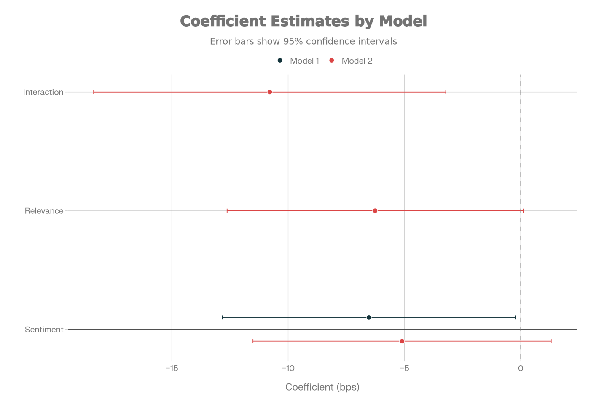

```{r setup, include=FALSE}
knitr::opts_chunk$set(echo = FALSE, warning = FALSE, message = FALSE)
```

# Introduction

In modern financial markets, information flows at unprecedented speeds. While prior research establishes that news affects asset prices, it typically relies on coarse sentiment proxies or focuses on very short event windows. Recent advances in natural language processing now enable automated extraction of granular sentiment and relevance measures from unstructured text.

This research integrates RavenPack news analytics with Compustat and CRSP data to examine whether media sentiment predicts medium-term abnormal stock returns. Using market-adjusted cumulative abnormal returns (CAR) over a 3-month horizon, we capture both short-run responses and subsequent drift or reversal in prices.

---

# Q1: Does Media Sentiment Predict Stock Returns?

**Hypothesis**

Positive media sentiment predicts positive subsequent abnormal returns (market underreaction), or alternatively, positive sentiment drives subsequent negative returns due to market overreaction and mean reversion.

**Methodology**

We calculate 3-month cumulative abnormal returns (CAR) as the rolling sum of daily abnormal returns (Stock Return minus Value-Weighted Market Return) over the window [t, t+2]. Using lagged sentiment to prevent look-ahead bias, we estimate:

$$CAR_{t,t+2} = \alpha + \beta_1 \text{Sentiment}_{t-1} + \epsilon_t$$

Data: 410,984 firm-month observations from 2010–2024, combining RavenPack (sentiment scores), CRSP (returns), and Compustat (fundamentals).

**Regression Results**

A statistically significant **negative coefficient** (β₁ = −6.529, p < 0.05) is found: a one standard deviation increase in lagged news sentiment is associated with a **6.5 basis point decrease** in 3-month forward returns. This rejects the underreaction hypothesis and **supports the overreaction and mean reversion hypothesis**: positive news triggers initial price enthusiasm, followed by subsequent correction over the medium term.

---

# Q2: Does News Relevance Amplify the Sentiment Effect?

**Hypothesis**

News relevance (how centrally the firm features in a story) conditions the sentiment–return relationship. High-relevance events should trigger stronger behavioral responses from investors compared to low-relevance noise.

**Methodology**

We extend the baseline model to include interaction effects:

$$CAR_{t,t+2} = \alpha + \beta_1 \text{Sentiment}_{t-1} + \beta_2 \text{Relevance}_{t-1}$$   

$$+ \beta_3(\text{Sentiment}_{t-1} \times \text{Relevance}_{t-1}) + \epsilon_t$$

Relevance and Sentiment are standardized (mean 0, SD = 1) to facilitate interpretation.

**Regression Results**

The interaction term is **negative and highly significant** (β₃ = −10.790, p < 0.01). This confirms that **relevance amplifies the mean reversion effect**: high-relevance positive news triggers a sharper initial price overreaction and consequently a more severe subsequent correction (−10.79 basis points additional decline). This pattern reflects attention-driven behavioral bias: clearer, more salient signals generate stronger investor overreaction.

| Variable | Coefficient | Std. Error | p-value |
|----------|------------|-----------|---------|
| Sentiment | −5.099 | 3.271 | 0.12 |
| Relevance | −6.258 | 3.247 | 0.06* |
| Sentiment × Relevance | −10.790 | 3.862 | <0.01*** |


---

# Q3: Is Media Coverage Distributed Equally Across Firms?

**Hypothesis**

Larger firms receive disproportionately higher media attention due to broader shareholder bases, higher trading volumes, and greater newsworthiness. This creates an information asymmetry between large and small-cap stocks.

**Methodology**

We aggregate news events to the firm level and sort firms into size deciles (D1 = smallest by total assets, D10 = largest). For each decile, we calculate: (1) median firm size, (2) average events per firm, and (3) average daily news events per firm.

**Results**

Media coverage exhibits a **sharp convex relationship with firm size**:


The largest firms receive **4.4× higher daily news coverage** than the smallest firms. This inequality likely reflects:   

- Broader institutional ownership and index inclusion   

- Greater economic significance of firm-level events    

- Media algorithms prioritizing high-traffic, high-impact stories

---

# Conclusion

Our findings reveal that **media sentiment exhibits a negative relationship with subsequent equity returns**, supporting the **overreaction and mean reversion hypothesis** in behavioral finance. A one standard deviation increase in lagged sentiment predicts approximately **6.5 basis points of underperformance**, with this effect amplified by **10.79 basis points for highly relevant news events**.

These results suggest that while news contains information, it often signals **mispricing rather than fundamental value improvements**. The "sell the news" pattern indicates that positive sentiment drives initial enthusiasm followed by subsequent correction.

Additionally, we document **substantial cross-sectional heterogeneity**: media coverage is strongly concentrated among large-cap firms, suggesting that sentiment-based trading signals may be applicable primarily to a subset of highly visible companies.

Despite modest explanatory power (R² < 0.01%), the robust statistical significance across both models confirms that media sentiment effects are genuine and not artifacts of data mining.