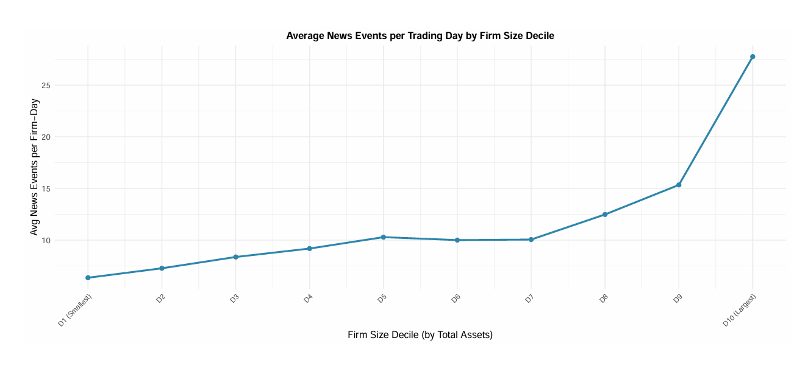

# News Media Disclosure: Sentiment, Information Salience, and Stock Return Reversals

## Overview
This project examines the relationship between RavenPack media disclosure metrics and medium-term U.S. stock returns across 410,984 firm-month observations (2010–2024).

## Key Research Findings
* **Market Overreaction:** Positive news sentiment negatively predicts 3-month forward CAR ($\beta_1 = -6.529$, $p < 0.05$), rejecting underreaction in favor of mean reversion.
* **Information Salience:** High news relevance amplifies price reversals ($\beta_3 = -10.790$, $p < 0.01$), indicating salient signals trigger stronger behavioral bias.
* **Coverage Bias:** Media attention exhibits a sharp convex bias toward large-cap firms (D10 receives $4.4\times$ the daily news coverage of D1).

## Key Deliverables
* [Full Research Paper (PDF)](Final-Project.pdf)
* [Project Poster (PDF)](Poster.pdf)

## How to Run
1. Open `Final Project.rmd` in RStudio.
2. Ensure required R packages (`tidyverse`, `stargazer`, `kableExtra`, `sandwich`) are installed.
3. Knit to PDF to reproduce all empirical specifications and tables.
